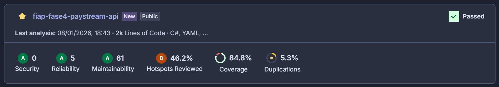
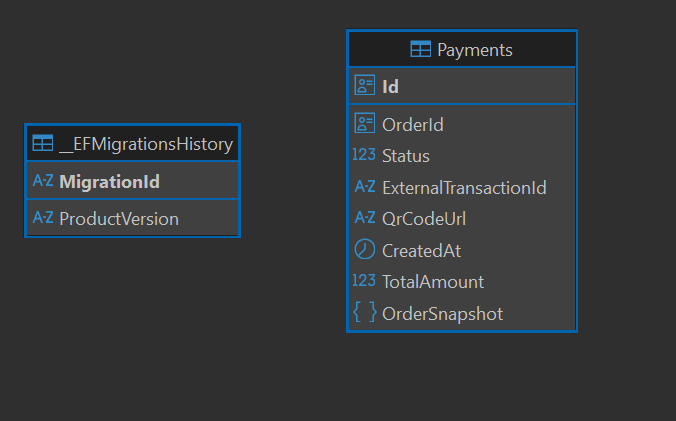
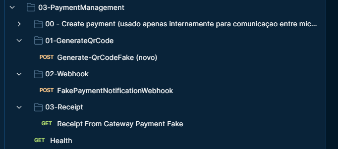
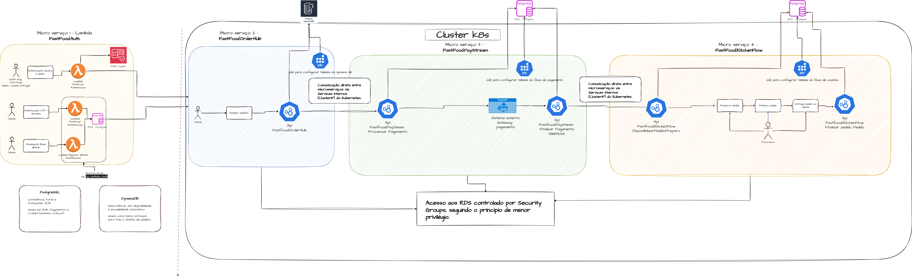

# PayStream API - Microsserviço de Pagamentos

## 🔍 Qualidade do Código

**Status de Qualidade:**



[](https://sonarcloud.io/project/overview?id=diegoknsk_fiap-fase4-paystream-api)
[](https://sonarcloud.io/project/overview?id=diegoknsk_fiap-fase4-paystream-api)
[](https://sonarcloud.io/project/overview?id=diegoknsk_fiap-fase4-paystream-api)
[](https://sonarcloud.io/project/overview?id=diegoknsk_fiap-fase4-paystream-api)
[](https://sonarcloud.io/project/overview?id=diegoknsk_fiap-fase4-paystream-api)

**Dashboard Completo**: [Visualizar no SonarCloud](https://sonarcloud.io/project/overview?id=diegoknsk_fiap-fase4-paystream-api)

---

## 📋 Visão Geral do Microsserviço PayStream

O **PayStream** é o microsserviço responsável por operacionalizar todo o fluxo de pagamentos do sistema FastFood. Ele atua no registro, acompanhamento e atualização do status de pagamentos, garantindo a integridade e rastreabilidade das transações financeiras.

### Responsabilidades Principais

- **Registro de Pagamentos**: Criação e persistência de intents de pagamento associados a pedidos
- **Geração de QR Code**: Integração com gateways de pagamento para gerar códigos QR para pagamento
- **Processamento de Pagamentos**: Processamento e atualização de status de pagamentos via webhooks
- **Consulta de Comprovantes**: Obtenção de comprovantes de pagamento do gateway externo
- **Integração com Outros Microsserviços**: Comunicação síncrona via HTTP com OrderHub e KitchenFlow

### Características Arquiteturais

O PayStream faz parte de uma **arquitetura de microsserviços desacoplados**, onde:

- Cada microsserviço é **implantado e escalado de forma independente**
- Cada microsserviço possui seu **próprio banco de dados exclusivo**
- A comunicação entre microsserviços ocorre via **HTTP REST** (síncrona) ou **mensageria** (assíncrona)
- **Nenhum microsserviço acessa diretamente o banco de dados de outro microsserviço**

---

## 🗄️ Banco de Dados – PostgreSQL (RDS)

O PayStream utiliza **PostgreSQL em RDS (Amazon Relational Database Service)** como banco de dados exclusivo para persistência de dados relacionados a pagamentos.

### Justificativa Arquitetural

A escolha do PostgreSQL para o domínio de pagamentos é fundamentada em requisitos críticos do domínio financeiro:

- **Consistência Forte**: Garante que todas as transações financeiras sejam registradas de forma consistente e confiável
- **Integridade Transacional (ACID)**: Suporta transações complexas com garantias de atomicidade, consistência, isolamento e durabilidade
- **Confiabilidade para Domínio Financeiro**: Banco de dados maduro e amplamente utilizado em sistemas financeiros críticos
- **Modelo Relacional Adequado**: Facilita auditoria, rastreabilidade e relacionamentos complexos entre entidades de pagamento

### Modelo de Dados

O banco de dados do PayStream armazena:

- **Pagamentos**: Informações completas sobre cada pagamento (ID, OrderId, Status, TotalAmount, etc.)
- **Transações**: Histórico de interações com gateways externos
- **Status Financeiros**: Estados e transições de status dos pagamentos
- **Identificadores Externos**: Mapeamento entre IDs internos e IDs de transações do gateway de pagamento

### Diagrama ER



O modelo relacional adotado segue princípios de normalização e integridade referencial, garantindo que os dados de pagamento sejam armazenados de forma estruturada e auditável. A tabela principal `Payments` centraliza as informações de pagamento, enquanto campos como `ExternalTransactionId` e `QrCodeUrl` permitem rastreabilidade completa do ciclo de vida do pagamento.

### Isolamento de Dados

⚠️ **Importante**: O banco de dados PostgreSQL do PayStream é **exclusivo** deste microsserviço. Nenhum outro microsserviço possui acesso direto a este banco de dados. A comunicação entre microsserviços ocorre exclusivamente via APIs HTTP ou mensageria, respeitando os princípios de desacoplamento e independência de microsserviços.

---

## 🔗 Endpoints e Contratos

O PayStream expõe uma API RESTful documentada via Swagger, organizada em contextos funcionais distintos.

### Documentação

- **Swagger UI**: Disponível em `/swagger` quando a aplicação está em execução
- **Collection Postman**: Disponível em `docs/CollectionTcFase4.json`

### Endpoints Disponíveis

A imagem abaixo ilustra os principais endpoints expostos pelo PayStream, organizados por contexto funcional:



#### Contexto: Payment Management

| Método | Endpoint | Descrição | Autenticação |
|--------|----------|-----------|--------------|
| `POST` | `/api/Payment/create` | Cria um novo pagamento (usado internamente para comunicação entre microsserviços) | Customer |
| `POST` | `/api/Payment/generate-qrcode` | Gera QR Code para pagamento | Customer |
| `GET` | `/api/Payment/receipt-from-gateway` | Obtém comprovante de pagamento do gateway | Customer |

#### Contexto: Webhook Payment

| Método | Endpoint | Descrição | Autenticação |
|--------|----------|-----------|--------------|
| `POST` | `/api/WebhookPayment/payment-notification` | Recebe notificação de pagamento do gateway externo | Anônimo |

#### Contexto: Health Check

| Método | Endpoint | Descrição | Autenticação |
|--------|----------|-----------|--------------|
| `GET` | `/Health` | Verifica saúde da aplicação | Opcional |

### Parâmetros de Query

Alguns endpoints suportam o parâmetro `fakeCheckout` para desenvolvimento e testes:

- `fakeCheckout=true`: Utiliza gateway de pagamento simulado (modo de desenvolvimento)
- `fakeCheckout=false` ou omitido: Utiliza gateway de pagamento real (Mercado Pago)

### Exemplo de Uso

```bash
# Gerar QR Code (modo fake para testes)
POST /api/Payment/generate-qrcode?orderId={orderId}&fakeCheckout=true

# Receber notificação de webhook (modo fake)
POST /api/WebhookPayment/payment-notification?orderId={orderId}&fakeCheckout=true

# Obter comprovante (modo fake)
GET /api/Payment/receipt-from-gateway?orderId={orderId}&fakeCheckout=true
```

---

## 🧩 Arquitetura do Microsserviço

O PayStream segue uma arquitetura de microsserviços independente, projetada para escalabilidade, manutenibilidade e desacoplamento.

### Características Arquiteturais

- **Microsserviço Independente**: Pode ser desenvolvido, implantado e escalado independentemente dos demais microsserviços
- **Comunicação Síncrona**: Comunicação via HTTP REST com OrderHub para criação de pagamentos
- **Banco Relacional Exclusivo**: PostgreSQL (RDS) dedicado, sem compartilhamento de dados com outros serviços
- **Deploy Independente**: Implantação e atualização sem impacto em outros microsserviços
- **Infraestrutura Orquestrada**: Deploy e gerenciamento via Kubernetes (EKS)

### Integração com Outros Microsserviços

O PayStream integra-se com outros microsserviços do ecossistema FastFood:



**Fluxo de Integração:**

1. **OrderHub → PayStream**: Solicitação de criação de pagamento via HTTP
2. **PayStream → Gateway Externo**: Geração de QR Code e processamento de pagamento
3. **Gateway Externo → PayStream**: Notificação de status via webhook
4. **PayStream → KitchenFlow**: Notificação de pagamento aprovado via HTTP

### Comunicação entre Microsserviços

A comunicação entre microsserviços ocorre via **Services internos (ClusterIP) do Kubernetes**, garantindo:

- Comunicação direta e eficiente dentro do cluster
- Isolamento de rede (não expostos externamente)
- Baixa latência e alta confiabilidade
- Segurança através de políticas de rede do Kubernetes

---

## 🧱 Clean Architecture (Abordagem Pragmática)

O PayStream adota uma **abordagem pragmática de Clean Architecture**, com aproximadamente **70% de aderência** aos princípios clássicos.

### Decisão Arquitetural

Esta abordagem foi uma **decisão consciente** do time, visando:

- **Evitar complexidade excessiva**: Balancear princípios arquiteturais com praticidade
- **Manter código legível e testável**: Priorizar clareza e manutenibilidade
- **Acelerar desenvolvimento**: Reduzir overhead de camadas desnecessárias
- **Alinhamento com mercado**: Seguir práticas comuns em projetos .NET enterprise

### Princípios Mantidos

Apesar da simplificação, os seguintes princípios são rigorosamente seguidos:

- ✅ **UseCases Claros**: Lógica de negócio centralizada em casos de uso bem definidos
- ✅ **Domínio Isolado**: Entidades de domínio puras, sem dependências de infraestrutura
- ✅ **Infra Desacoplada**: Implementações de infraestrutura isoladas e substituíveis
- ✅ **Injeção de Dependência**: Concentrada na borda (API), facilitando testes e manutenção

### Estrutura de Camadas

```
src/
├── Core/
│   ├── Domain/              # Entidades, Value Objects, Regras de Negócio
│   └── Application/         # UseCases, Ports, Presenters, Responses
├── Infra/
│   ├── Infra/               # Serviços externos (Gateways, HTTP Clients)
│   └── Infra.Persistence/   # Repositórios, DbContext, Migrations
└── InterfacesExternas/
    └── Api/                 # Controllers, Program.cs, Configurações
```

### Vantagens da Abordagem Pragmática

- **Menos Overhead**: Redução de camadas intermediárias desnecessárias
- **Fácil Onboarding**: Estrutura mais simples para novos desenvolvedores
- **Testabilidade Mantida**: Princípios de inversão de dependência preservados
- **Flexibilidade**: Facilita ajustes e evolução do código

⚠️ **Nota**: Esta é uma decisão arquitetural consciente, não uma limitação técnica. O projeto poderia seguir 100% dos princípios de Clean Architecture, mas optou-se por uma abordagem mais pragmática que atende aos requisitos de qualidade e manutenibilidade.

---

## 🧪 Qualidade, Testes e BDD

O PayStream mantém um rigoroso processo de garantia de qualidade, com foco em cobertura de testes, testes BDD e validação contínua via SonarCloud.

### Cobertura de Testes

O projeto mantém aproximadamente **80% de cobertura de código**, validado continuamente pelo SonarCloud.

**Camadas Cobertas:**

- ✅ **Domain**: Entidades, Value Objects, Enums, Validações de Domínio
- ✅ **Application**: UseCases, Presenters, InputModels, OutputModels
- ✅ **Infra**: Repositórios, Gateways, Serviços Externos
- ✅ **API**: Controllers (PaymentController, WebhookPaymentController, HealthController)

### Testes Implementados

#### Testes Unitários

- **Domain Tests**: Validação de regras de negócio e comportamentos das entidades
- **Application Tests**: Validação de lógica de casos de uso e transformações
- **Infra Tests**: Validação de integrações com mocks e stubs
- **API Tests**: Validação de endpoints, autenticação e respostas HTTP

#### Testes BDD (Behavior Driven Development)

O projeto implementa **pelo menos um fluxo crítico em BDD** usando SpecFlow:

**Feature: Payment Flow**

```gherkin
Feature: Payment Flow
    As a customer
    I want to create and process a payment
    So that I can complete my order

    Scenario: Customer creates payment and processes successfully
        Given I have a valid order with ID "123e4567-e89b-12d3-a456-426614174000"
        And the order total amount is 100.00
        When I create a payment for this order
        Then the payment should be created with status "NotStarted"
        When I generate a QR code for the payment
        Then the payment should have status "QrCodeGenerated"
        And the payment should have a QR code URL
        When the payment gateway confirms the payment
        Then the payment should have status "Approved"
        And the payment should have an external transaction ID
```

Este teste BDD valida o fluxo completo de criação e processamento de pagamento, garantindo que o comportamento esperado do sistema seja validado de forma clara e legível.

### Qualidade Garantida por SonarCloud

O projeto utiliza **SonarCloud** para análise contínua de qualidade de código:

- **Quality Gate**: Bloqueia merges que não atendam aos critérios de qualidade
- **Análise de Código**: Detecção de code smells, bugs e vulnerabilidades
- **Métricas de Cobertura**: Monitoramento contínuo da cobertura de testes
- **Relatórios Detalhados**: Análise de duplicação, complexidade e manutenibilidade

📊 **[Acessar Dashboard do SonarCloud](https://sonarcloud.io/project/overview?id=diegoknsk_fiap-fase4-paystream-api)**

### Pipeline CI Valida

O pipeline de CI/CD valida automaticamente:

- ✅ **Build**: Compilação do projeto sem erros
- ✅ **Testes**: Execução de todos os testes unitários e BDD
- ✅ **Cobertura**: Validação de cobertura mínima de 80%
- ✅ **SonarCloud**: Análise de qualidade e validação do Quality Gate

### Executar Testes Localmente

```bash
# Executar todos os testes
dotnet test

# Executar testes com cobertura
dotnet test /p:CollectCoverage=true /p:CoverletOutputFormat=opencover

# Executar apenas testes BDD
dotnet test --filter "FullyQualifiedName~FastFood.PayStream.Tests.Bdd"
```

⚠️ **Esta seção é crítica para avaliação da FIAP**, evidenciando o compromisso do projeto com qualidade de código, testes abrangentes e práticas de desenvolvimento ágil.

---

## 🔐 Segurança e Configurações

O PayStream implementa práticas de segurança robustas para proteção de dados sensíveis e credenciais.

### Variáveis de Ambiente

Todas as configurações sensíveis são gerenciadas via variáveis de ambiente:

- **Connection Strings**: Credenciais de banco de dados
- **API Keys**: Chaves de acesso a serviços externos (Mercado Pago)
- **JWT Secrets**: Chaves para validação de tokens JWT
- **URLs de Serviços**: Endpoints de outros microsserviços

### Secrets Management

- **Kubernetes Secrets**: Credenciais armazenadas como Secrets do Kubernetes
- **GitHub Secrets**: Credenciais AWS e tokens para CI/CD
- **Nenhuma Credencial Versionada**: Todas as credenciais são gerenciadas externamente

### Acesso ao Banco de Dados

- **Acesso Restrito**: Apenas o serviço PayStream possui acesso ao banco PostgreSQL
- **Security Groups**: Controle de acesso via Security Groups da AWS (princípio de menor privilégio)
- **Connection String Segura**: Credenciais nunca expostas em código ou logs

### Autenticação e Autorização

- **JWT Bearer Authentication**: Autenticação via tokens JWT
- **Políticas de Autorização**: Controle de acesso baseado em políticas (Customer, Admin)
- **Webhook Seguro**: Endpoints de webhook validam origem e integridade das requisições

---

## 🚀 Tecnologias e Ferramentas

### Stack Tecnológico

- **.NET 8**: Framework principal
- **ASP.NET Core**: API RESTful
- **PostgreSQL**: Banco de dados relacional (RDS)
- **Entity Framework Core**: ORM para acesso a dados
- **xUnit**: Framework de testes
- **SpecFlow**: Testes BDD
- **SonarCloud**: Análise de qualidade de código

### Infraestrutura

- **Kubernetes (EKS)**: Orquestração de containers
- **Amazon ECR**: Registry de imagens Docker
- **Amazon RDS**: Banco de dados gerenciado
- **GitHub Actions**: CI/CD pipeline

---

## 📚 Documentação Adicional

- [Configuração de CI/CD](docs/CI_CD_SETUP.md)
- [Collection Postman](docs/CollectionTcFase4.json)
- [Regras de Arquitetura](rules/ARCHITECTURE_RULES.md)

---

## 📝 Licença

Este projeto faz parte do Tech Challenge – Fase 4 da Pós Tech (Arquitetura de Microsserviços) da FIAP.

---

## 👥 Contribuidores

Desenvolvido como parte do trabalho acadêmico da FIAP - Pós Tech.
